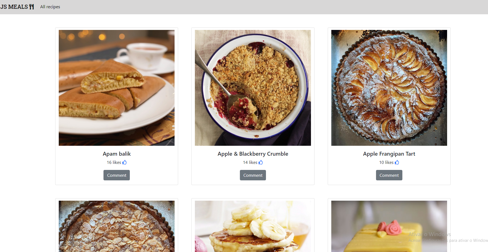

# JavaScript Capstone - JS Meals

> This is a website for showing dishes and interacting with them.



In this website we are interacting with two different APIs not only to show the meals but also to let users like them and/or comment about them.

## Built With

- JavaScript
- HTML&CSS
- Bootstrap
- Webpack
- Git & Github

## Live Demo

[Live Demo Link](https://livedemo.com)


## Getting Started

To get a local copy up and running follow these simple example steps.

### Prerequisites

- Github account
- Browser
- Commandline
### Setup

First you need to clone this repository locally following these steps:
- Choose a place where you would want to create the repository
- Navigate there with your commandline
- Use this command in the commandline ```git clone git@github.com:jmontanholi/JavaScriptCapstone-joao-sebastian.git```
### Install

For installation you will need to:
- open your terminal
- go to your recently cloned repository
- Use the following command to install everything you need ```npm install```
### Usage

To use the project locally you just need to run this command ```npm run start```
### Run tests

To run the tests you just need to run this command ```npm test```

## Authors

👤 **João Vítor Montanholi Nunes**

- GitHub: [jmontanholi](https://github.com/jmontanholi)
- Twitter: [MontanholiNunes](https://twitter.com/MontanholiNunes)
- LinkedIn: [Joao vitor montanholi](https://www.linkedin.com/in/joaovitormontanholi/)

👤 **Sebastian Muñoz**

- GitHub: [@githubhandle](https://github.com/githubhandle)
- Twitter: [@twitterhandle](https://twitter.com/twitterhandle)
- LinkedIn: [LinkedIn](https://linkedin.com/in/linkedinhandle)

## 🤝 Contributing

Contributions, issues, and feature requests are welcome!

Feel free to check the [issues page](../../issues/).

## Show your support

Give a ⭐️ if you like this project!

## Acknowledgments

- Thunder Client VSC extension.
- Microverse.

## 📝 License

This project is [MIT](./MIT.md) licensed.
